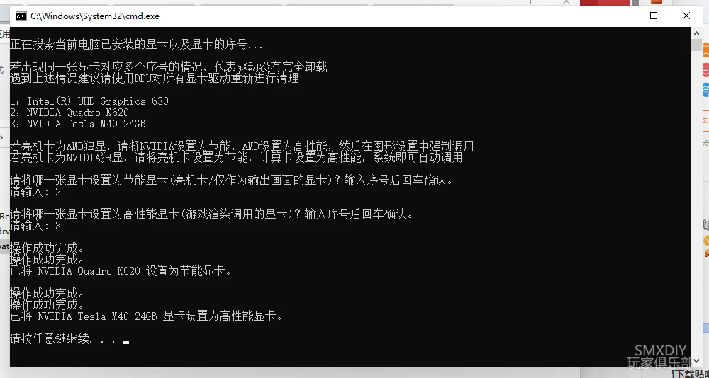
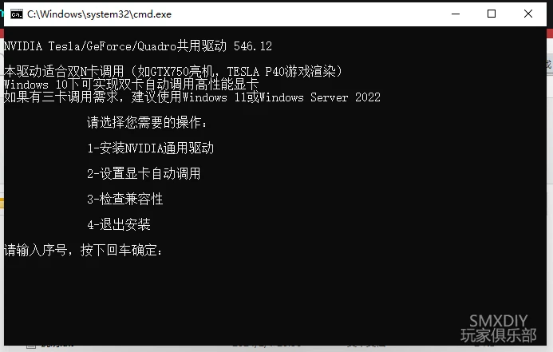
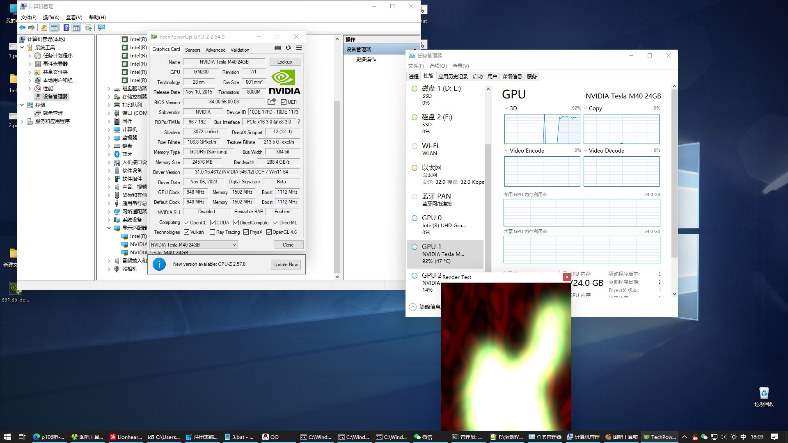
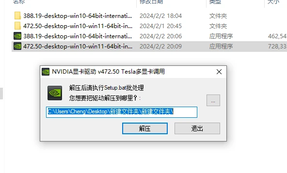

# 使用双N卡来使用Tesla P40，1050 + Tesla P40

**优秀教程：**
使用DDU删除驱动：https://www.youtube.com/watch?v=ao32QO2nmOg

注册表更改：https://www.bilibili.com/video/BV1Wj411S7vK/?spm_id_from=333.337.search-card.all.click&vd_source=15b4bc8968fa5203cc470cb68ff72c96

优秀文章：https://www.aihubpro.cn/31789.html


**双N卡例如GeForce+Tesla**之前一直被别人诟病无法共用驱动，于是我顺着前人摸索过的路继续研究，做出了这款可以一键安装一键配置的驱动整合包。

本驱动使用官方CUDA Toolkit驱动+GameReady外壳修改而成，自动安装PhysX，可以选择不安装RTX Desktop Manager，支持双N卡/多显卡（我是用三显卡测试的）

- **546.12驱动** 支持麦克斯韦Maxwell(GM)-阿达Ada Lovelace(AD)架构的显卡 支持GTX745，GTX750，GTX750Ti，GeForce 8/9/10/16/20/30/40系(含移动版不锁驱动版)，Tesla M系及以上的计算卡(如M40，P40，P4)的驱动共存 支持Win10/Win11自动调用（已测试Win10 1809，Win10 22H2，Win11 21H2）
- **472.50驱动** 支持开普勒Kepler(GK)–安培Ampere(GA)架构的显卡 支持GeForce 6系除GT610，GT620外的所有显卡和GeForce 7/8/9/10/16/20/30系全部显卡(含移动版不锁驱动版)，Tesla M系及以上的计算卡(如M40，P40，P4)的驱动共存 支持Win10/Win11自动调用（已测试Win10 1809，Win10 21H2，Win11 21H2）
- **388.19驱动** 支持费米Fermi(GF)–图灵Turing(TU)架构的显卡 包含GeForce 4系以上显卡，Tesla M系及以上的计算卡(如M40，P40，P4)，CMP系列(如P106，40HX)的驱动共存 仅支持Windows Server 2022/Win11强制调用（已测试WinSrv2022，Win11 21H2，Win10 InsiderPreview 21390.2025）

原版驱动有WHQL签名，仅对注册表有改动，理论可过小蓝熊等反作弊检测 修改原理：原驱动取自英伟达CudaToolkit开发者驱动，只做了移植（把Display.Driver文件夹，ListDevices.txt替换到相近版本GameReady驱动包内） 最重要的还是写了一个节能/高性能显卡切换脚本，不需要手动改注册表了，脚本;可提取出来单独使用

```shell
@echo off
setlocal enabledelayedexpansion
%1 %2
ver|find "5.">nul&&goto :search_graphicscard
mshta vbscript:createobject("shell.application").shellexecute("%~s0","goto :search_graphicscard","","runas",1)(window.close)&goto :eof

:search_graphicscard
:: 设置注册表项的路径
set reg_path=HKEY_LOCAL_MACHINE\SYSTEM\CurrentControlSet\Control\Class\{4d36e968-e325-11ce-bfc1-08002be10318}

:: 查找设备名称
echo.
echo 正在搜索当前电脑已安装的显卡以及显卡的序号...
echo.
echo 若出现同一张显卡对应多个序号的情况，代表驱动没有完全卸载
echo 遇到上述情况建议请使用DDU对所有显卡驱动重新进行清理
echo.
for /f "tokens=*" %%a in ('reg query "%reg_path%"') do (
    set "line=%%a"
    set "last_four_chars=!line:~-4!"
    if "!last_four_chars!"=="0000" (
        set "reg_key=!reg_path!\0000"
        for /f "tokens=2,*" %%b in ('reg query "!reg_key!" /v DriverDesc 2^>nul ^| findstr /i "DriverDesc"') do (
                set "driver_desc=%%c"
                echo !line:~-1!：!driver_desc!
        )
    ) else if "!last_four_chars!"=="0001" (
       set "reg_key=!reg_path!\0001"
        for /f "tokens=2,*" %%b in ('reg query "!reg_key!" /v DriverDesc 2^>nul ^| findstr /i "DriverDesc"') do (
                set "driver_desc=%%c"
                echo !line:~-1!：!driver_desc!
        )
    ) else if "!last_four_chars!"=="0002" (
       set "reg_key=!reg_path!\0002"
        for /f "tokens=2,*" %%b in ('reg query "!reg_key!" /v DriverDesc 2^>nul ^| findstr /i "DriverDesc"') do (
                set "driver_desc=%%c"
                echo !line:~-1!：!driver_desc!
        )
    ) else if "!last_four_chars!"=="0003" (
       set "reg_key=!reg_path!\0003"
        for /f "tokens=2,*" %%b in ('reg query "!reg_key!" /v DriverDesc 2^>nul ^| findstr /i "DriverDesc"') do (
                set "driver_desc=%%c"
                echo !line:~-1!：!driver_desc!
        )
    ) else if "!last_four_chars!"=="0004" (
       set "reg_key=!reg_path!\0004"
        for /f "tokens=2,*" %%b in ('reg query "!reg_key!" /v DriverDesc 2^>nul ^| findstr /i "DriverDesc"') do (
                set "driver_desc=%%c"
                echo !line:~-1!：!driver_desc!
        )
    ) else if "!last_four_chars!"=="0005" (
       set "reg_key=!reg_path!\0005"
        for /f "tokens=2,*" %%b in ('reg query "!reg_key!" /v DriverDesc 2^>nul ^| findstr /i "DriverDesc"') do (
                set "driver_desc=%%c"
                echo !line:~-1!：!driver_desc!
        )
    ) else if "!last_four_chars!"=="0006" (
       set "reg_key=!reg_path!\0006"
        for /f "tokens=2,*" %%b in ('reg query "!reg_key!" /v DriverDesc 2^>nul ^| findstr /i "DriverDesc"') do (
                set "driver_desc=%%c"
                echo !line:~-1!：!driver_desc!
        )
    ) else if "!last_four_chars!"=="0007" (
       set "reg_key=!reg_path!\0007"
        for /f "tokens=2,*" %%b in ('reg query "!reg_key!" /v DriverDesc 2^>nul ^| findstr /i "DriverDesc"') do (
                set "driver_desc=%%c"
                echo !line:~-1!：!driver_desc!
        )
    )
)

echo.
echo 若亮机卡为AMD独显，请将NVIDIA设置为节能，AMD设置为高性能，然后在图形设置中强制调用
echo 若亮机卡为NVIDIA独显，请将亮机卡设置为节能，计算卡设置为高性能，系统即可自动调用
echo.
:: 询问用户选择
echo 请将哪一张显卡设置为节能显卡(亮机卡/仅作为输出画面的显卡)？输入序号后回车确认。
set /p powersave_num=请输入: 
echo.
echo 请将哪一张显卡设置为高性能显卡(游戏渲染调用的显卡)？输入序号后回车确认。
set /p highperformance_num=请输入: 
echo.
:: 设置节能显卡
    set "powersave_reg=%reg_path%\000%powersave_num%"
    reg add "!powersave_reg!" /v "EnableMsHybrid" /t REG_DWORD /d 00000002 /f
    reg add "!powersave_reg!" /v "GridLicensedFeatures" /t REG_DWORD /d 00000007 /f
	set "reg_key=!reg_path!\000%powersave_num%"
    for /f "tokens=2,*" %%b in ('reg query "!reg_key!" /v DriverDesc 2^>nul ^| findstr /i "DriverDesc"') do (
	set "driver_desc=%%c")
    echo 已将 !driver_desc! 设置为节能显卡。
	echo.

:: 设置高性能显卡
    set "highperformance_reg=%reg_path%\000%highperformance_num%"
    reg add "!highperformance_reg!" /v "EnableMsHybrid" /t REG_DWORD /d 00000001 /f
    reg add "!highperformance_reg!" /v "GridLicensedFeatures" /t REG_DWORD /d 00000007 /f
    reg delete "!highperformance_reg!" /v "AdapterType" /f
	reg add "!highperformance_reg!" /v "FeatureScore" /t REG_DWORD /d "d1" /f
	set "reg_key=!reg_path!\000%highperformance_num%"
    for /f "tokens=2,*" %%b in ('reg query "!reg_key!" /v DriverDesc 2^>nul ^| findstr /i "DriverDesc"') do (
	set "driver_desc=%%c")
    echo 已将 !driver_desc! 显卡设置为高性能显卡。
	echo.
pause


:recovery_set
cls
echo.
echo 若设置正确，在设备管理器内禁用并启用显卡或者重启系统后即可生效
echo.
echo 若设置有误，输入N还原默认"显卡调用"设定
echo.
SET /P RECOVERY_SET="输入Y或者直接回车为跳过本步骤，输入N还原设定：  "
IF /I "%RECOVERY_SET%" EQU "N" GOTO :recovery_mshybrid
IF /I "%RECOVERY_SET%" EQU "Y" GOTO :eof

REM --Cheking for input
cls
goto :eof


:recovery_mshybrid
echo 正在还原设定
reg delete HKEY_LOCAL_MACHINE\SYSTEM\CurrentControlSet\Control\Class\{4d36e968-e325-11ce-bfc1-08002be10318}\0000 /v EnableMsHybrid /f
reg delete HKEY_LOCAL_MACHINE\SYSTEM\CurrentControlSet\Control\Class\{4d36e968-e325-11ce-bfc1-08002be10318}\0001 /v EnableMsHybrid /f
reg delete HKEY_LOCAL_MACHINE\SYSTEM\CurrentControlSet\Control\Class\{4d36e968-e325-11ce-bfc1-08002be10318}\0002 /v EnableMsHybrid /f
reg delete HKEY_LOCAL_MACHINE\SYSTEM\CurrentControlSet\Control\Class\{4d36e968-e325-11ce-bfc1-08002be10318}\0003 /v EnableMsHybrid /f
reg delete HKEY_LOCAL_MACHINE\SYSTEM\CurrentControlSet\Control\Class\{4d36e968-e325-11ce-bfc1-08002be10318}\0004 /v EnableMsHybrid /f
reg delete HKEY_LOCAL_MACHINE\SYSTEM\CurrentControlSet\Control\Class\{4d36e968-e325-11ce-bfc1-08002be10318}\0005 /v EnableMsHybrid /f
reg delete HKEY_LOCAL_MACHINE\SYSTEM\CurrentControlSet\Control\Class\{4d36e968-e325-11ce-bfc1-08002be10318}\0006 /v EnableMsHybrid /f
reg delete HKEY_LOCAL_MACHINE\SYSTEM\CurrentControlSet\Control\Class\{4d36e968-e325-11ce-bfc1-08002be10318}\0007 /v EnableMsHybrid /f

reg delete HKEY_LOCAL_MACHINE\SYSTEM\CurrentControlSet\Control\Class\{4d36e968-e325-11ce-bfc1-08002be10318}\0000 /v AdapterType /f
reg delete HKEY_LOCAL_MACHINE\SYSTEM\CurrentControlSet\Control\Class\{4d36e968-e325-11ce-bfc1-08002be10318}\0001 /v AdapterType /f
reg delete HKEY_LOCAL_MACHINE\SYSTEM\CurrentControlSet\Control\Class\{4d36e968-e325-11ce-bfc1-08002be10318}\0002 /v AdapterType /f
reg delete HKEY_LOCAL_MACHINE\SYSTEM\CurrentControlSet\Control\Class\{4d36e968-e325-11ce-bfc1-08002be10318}\0003 /v AdapterType /f
reg delete HKEY_LOCAL_MACHINE\SYSTEM\CurrentControlSet\Control\Class\{4d36e968-e325-11ce-bfc1-08002be10318}\0004 /v AdapterType /f
reg delete HKEY_LOCAL_MACHINE\SYSTEM\CurrentControlSet\Control\Class\{4d36e968-e325-11ce-bfc1-08002be10318}\0005 /v AdapterType /f
reg delete HKEY_LOCAL_MACHINE\SYSTEM\CurrentControlSet\Control\Class\{4d36e968-e325-11ce-bfc1-08002be10318}\0006 /v AdapterType /f
reg delete HKEY_LOCAL_MACHINE\SYSTEM\CurrentControlSet\Control\Class\{4d36e968-e325-11ce-bfc1-08002be10318}\0007 /v AdapterType /f
:eof
endlocal
pause
```




patch_drv.bat可自由设置“节能”与“高性能”显卡（仅4xx，5xx驱动）



Setup.bat主页面



三显卡正常调用



